<div align="center">

# Fedorix 🐧

A beginner-friendly GNOME setup guide for Fedora. same workflow, just better.

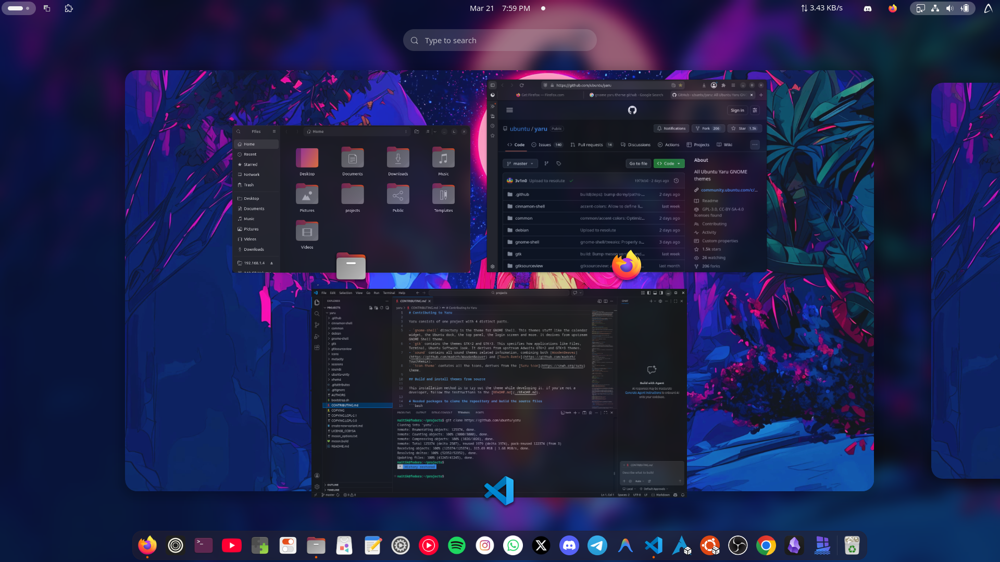

</div>

---

### Table of Contents
- [Before you start](#before-you-start)
- [Introduction](#introduction)
- [Preview](#preview)
- [Appearance](#appearance)
  - [System & Icon Theme (Yaru)](#system--icon-theme-yaru)
  - [Cursor Theme (macOS Cursor)](#cursor-theme-macos-cursor)
  - [Sound Theme (MIUI)](#sound-theme-miui)
  - [Fonts (Ubuntu)](#fonts-ubuntu)
- [Extensions](#extensions)
  - [Must have](#must-have)
  - [Optional](#optional)
  - [Extension Configurations](#extension-configurations)
- [Setup Guide](#setup-guide)
- [Applications](#applications)
  - [Firefox (Add Water)](#firefox-add-water)
  - [Zen Browser](#zen-browser)
  - [Clipboard Manager](#clipboard-manager)
  - [Terminal](#terminal)
  - [VS Code & Dev Environment](#vs-code--dev-environment)
- [Extras](#extras)
  - [Distrobox](#distrobox)
  - [Winboat](#winboat)
  - [Alt + Drag Windows](#alt--drag-windows)
- [Directory Structure](#directory-structure)
- [Troubleshooting](#troubleshooting)
- [Credits](#credits)

---

<div align="left">

## Introduction

This is not a heavy rice. Not a mac clone. Just GNOME but better.

Fedorix is a beginner-friendly setup guide for Fedora. The idea is simple
keep everything familiar while fixing the small things that bother you in
daily use. Fonts, blur, launcher, dock. Nothing dramatic, nothing complicated.

**New to Linux or GNOME? No problem.**
If you're comfortable running a few terminal commands, you have everything
you need to follow this guide. Every step is explained, and every setting
has a screenshot no guessing required.

This is not a fully transformed desktop. It's not plain stock GNOME either.
It's the sweet spot same workflow you already know, just cleaner,
smoother, and more comfortable to use every day.

Every extension here has a reason. Nothing was added just to look fancy.
The real difference comes from *how* things are configured, not just
what's installed. Make sure to check the
[Extension Configurations](#extension-configurations) screenshots
just installing the extensions won't get you there.

You can get the full setup running in about **1–2 hours**.
Or just pick what you need every section works independently.

> **Built for people who want GNOME to feel better not different.**

</div>

---

## Before You Start

A few things to know before you begin.

- **Fresh Fedora install is recommended** but not required. An existing setup works too, just be careful with themes.
- **Basic terminal knowledge is enough.** You only need to copy and run a few commands. Nothing advanced.
- **Install extensions one by one**, not all at once. It's easier to troubleshoot that way.
- **Every section is independent.** You don't have to follow everything. Pick only what you need.
- **Estimated time: 1–2 hours** for the full setup. Less if you skip sections.

> [!TIP]
> Not sure where to start? Follow the [Setup Guide](#setup-guide) — it walks you through everything in order.

> [!IMPORTANT]
> Most of the visual polish comes from **configuring** extensions rather than just installing them. Make sure to check the [Extension Configurations](#extension-configurations) screenshots because the defaults will not get you there.

---
## Preview

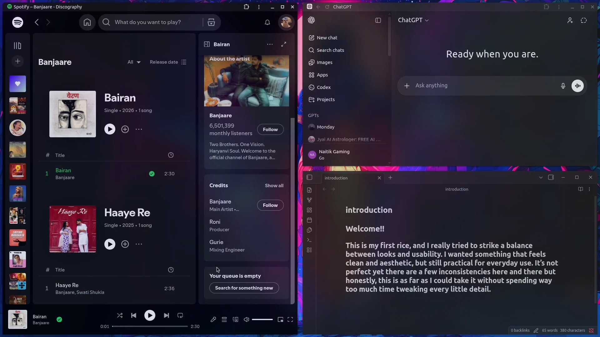

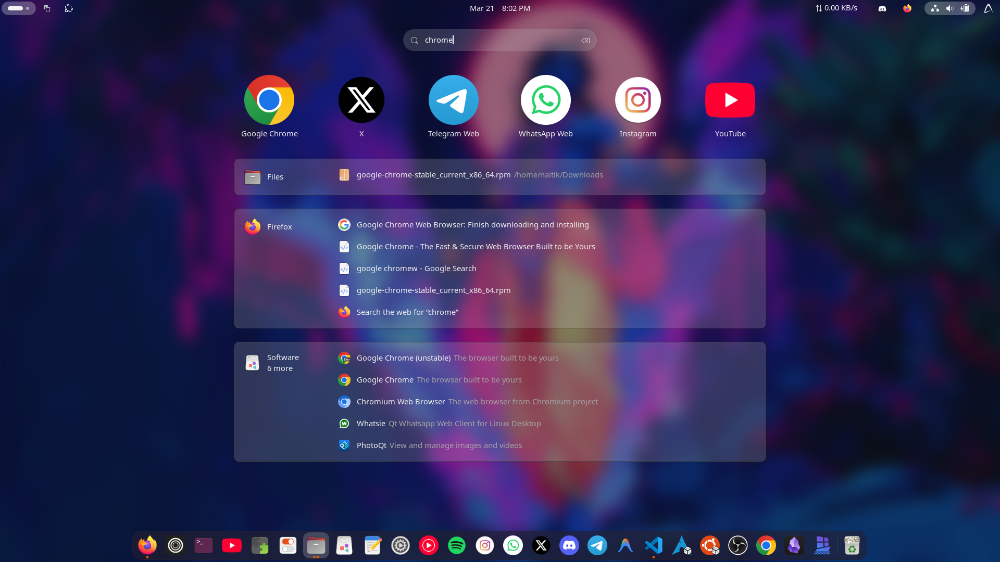

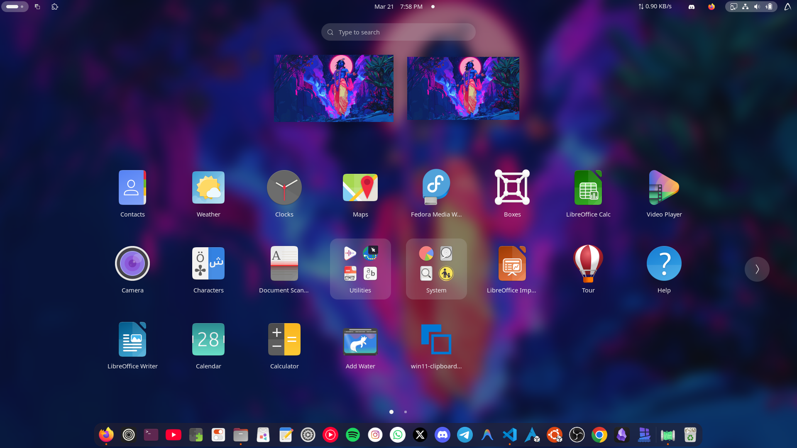

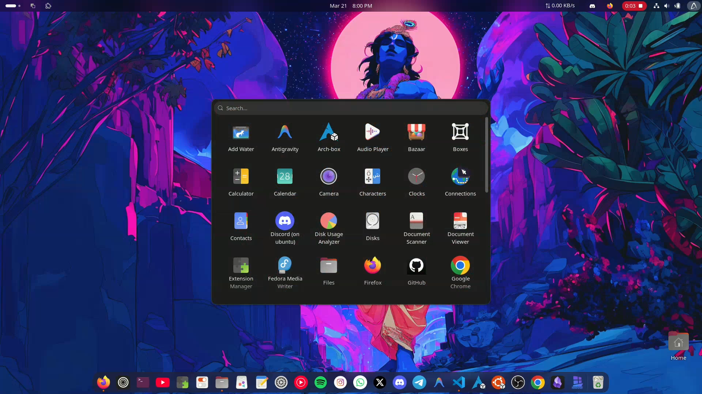

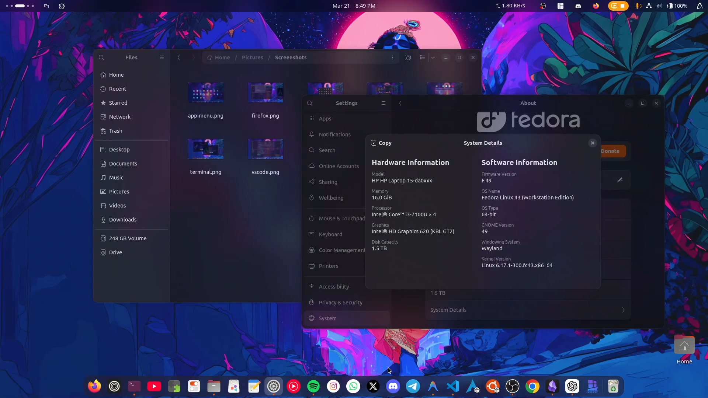

---

## Appearance

To apply these themes, make sure you have **GNOME Tweaks** installed. 

### System & Icon Theme (Yaru)

The Yaru dark theme from Ubuntu is clean and consistent.

🔗 [github.com/ubuntu/yaru](https://github.com/ubuntu/yaru)

**Installation Using package manager:**

Fedora:
```bash
sudo dnf install yaru-theme
```

Ubuntu:
```bash
sudo apt install yaru-theme
```

**Manual Installation:**
```bash
git clone https://github.com/ubuntu/yaru.git
mkdir -p ~/.themes ~/.icons
cd yaru
cp -r themes/Yaru* ~/.themes/
cp -r icons/Yaru* ~/.icons/
```

**Applying the theme:**

Open **GNOME Tweaks → Appearance** and set:

```
Icons            → Yaru-Dark
Shell            → Yaru-Dark  (requires User Themes extension)
Legacy Apps      → Yaru-Dark
```

---

### Cursor Theme (macOS Cursor)

🔗 [gnome-look.org/p/1408466](https://www.gnome-look.org/p/1408466)

**Installation:**

1. Download the theme from the link above — you will get `macOS.tar.xz`
2. Right click and extract it — you will get a folder named `macOS`
3. Move the `macOS` folder to:

```
~/.local/share/icons/
```

> If the `icons` folder does not exist, create it manually.

**Applying the theme:**

Open **GNOME Tweaks → Appearance → Cursor** and select `macOS`.

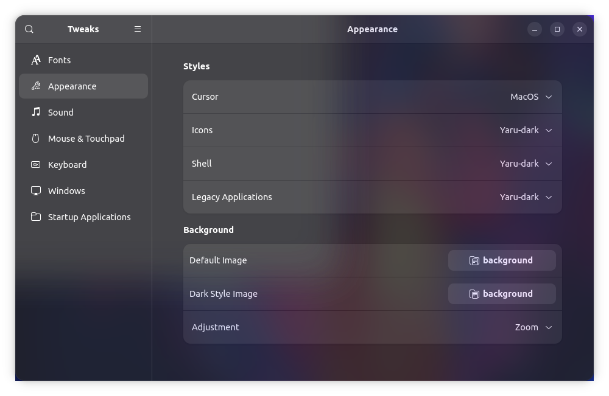

---

### Sound Theme (MIUI)

🔗 [gnome-look.org/p/1375637](https://www.gnome-look.org/p/1375637)

**Installation:**

1. Download the theme from the link above — you will get `MIUI.tar.gz`
2. Right click and extract it — you will get a folder named `MIUI`
3. Move the `MIUI` folder to:

```
~/.local/share/sounds/
```

> If the `sounds` folder does not exist, create it manually.

**Applying the theme:**

Open **GNOME Tweaks → Sound** and select `MIUI`.

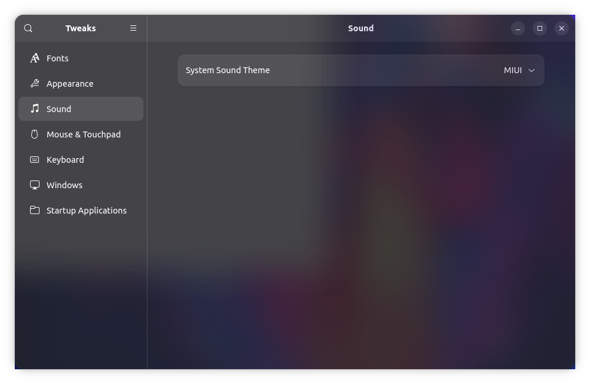

---

### Fonts (Ubuntu)

🔗 [fonts.google.com/specimen/Ubuntu](https://fonts.google.com/specimen/Ubuntu)

**Installation:**

1. Download the font from Google Fonts using the link above.
2. Extract the `.zip` file.
3. Double click any `.ttf` file to open it in GNOME Font Viewer.
4. Click the **"Install"** button.

*(Optional Advanced Method)*:
```bash
mkdir -p ~/.local/share/fonts
cp *.ttf ~/.local/share/fonts/
fc-cache -fv
```

**Applying the fonts:**

Open **GNOME Tweaks → Fonts** and configure them as follows:

| Usage          | Font            |
|----------------|-----------------|
| Interface Text | `Ubuntu`        |
| Document Text  | `Ubuntu Medium` |
| Monospace Text | `Monospace`     |

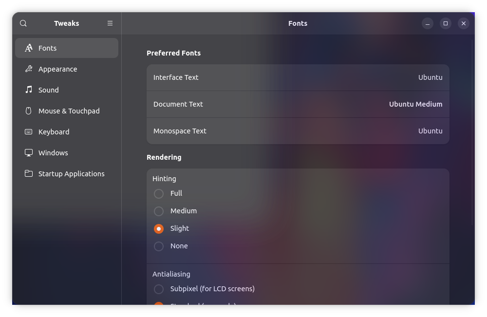

**Titlebar buttons added**

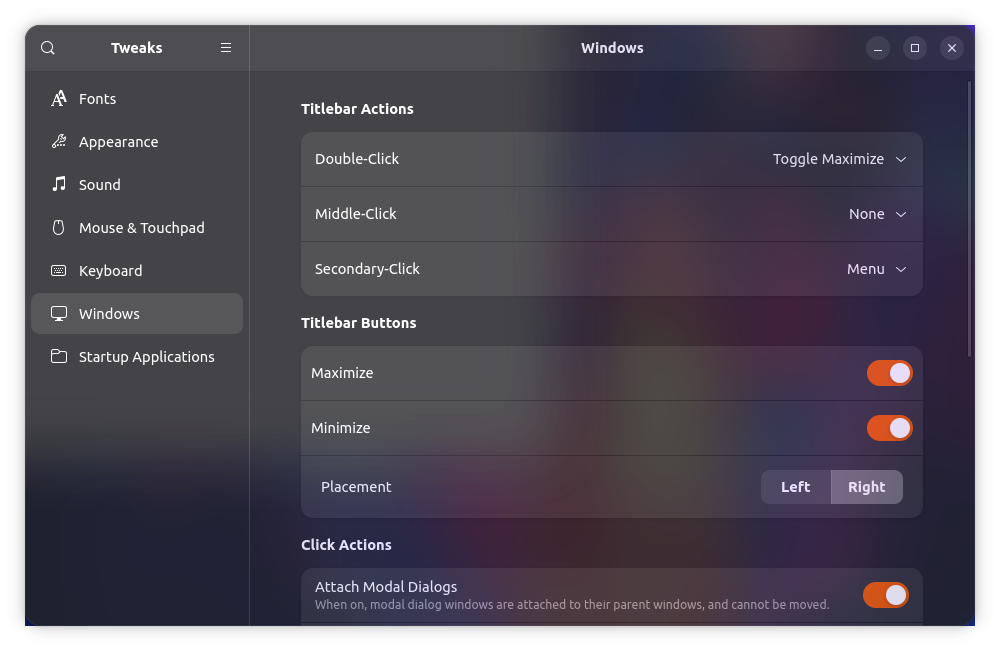

---

## Extensions

Extensions do a lot of the heavy lifting here. Install only what you need. Start with Must Have, then add Optional ones based on your workflow.

Install from [extensions.gnome.org](https://extensions.gnome.org) or use [Extension Manager](https://flathub.org/apps/com.mattjakeman.ExtensionManager) from Flathub.

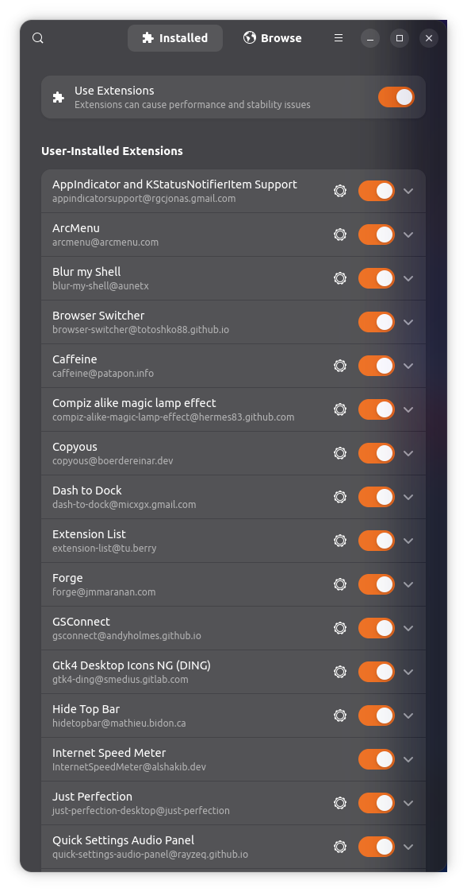

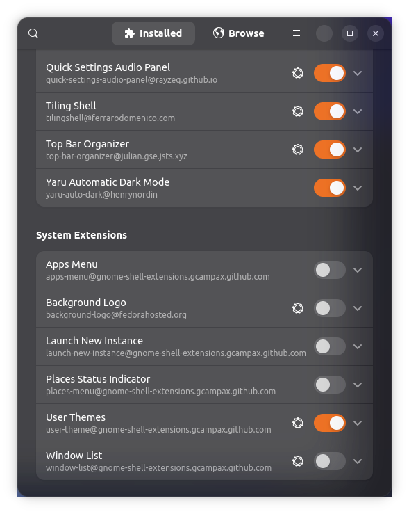

---

### Must Have

Start with these. These are the core extensions that make the biggest difference.

- [**Blur My Shell**](https://extensions.gnome.org/extension/3193/blur-my-shell/) - Adds blur to panels, overview, and dash. The single biggest visual upgrade.
- [**Dash to Dock**](https://extensions.gnome.org/extension/307/dash-to-dock/) - Turns the GNOME dash into a persistent dock.
- [**User Themes**](https://extensions.gnome.org/extension/19/user-themes/) - Required to apply a custom Shell theme.
- [**Just Perfection**](https://extensions.gnome.org/extension/3843/just-perfection/) - Hides and fine tunes GNOME Shell UI elements.
- [**ArcMenu**](https://extensions.gnome.org/extension/3628/arcmenu/) - Replaces the default app grid with a proper launcher.
- [**AppIndicator & KStatusNotifierItem Support**](https://extensions.gnome.org/extension/615/appindicator-support/) - Adds system tray icon support.
- [**GTK4 Desktop Icons NG (DING)**](https://extensions.gnome.org/extension/5263/gtk4-desktop-icons-ng-ding/) - Desktop icon support.
- [**GSConnect**](https://extensions.gnome.org/extension/1319/gsconnect/) - Phone and desktop sync via KDE Connect.
- [**Caffeine**](https://extensions.gnome.org/extension/517/caffeine/) - Prevents screen from sleeping.

---

### Optional

Install only what fits your workflow. You do not need all of these.

- [**Forge Tiling**](https://extensions.gnome.org/extension/4481/forge/) - Manual tiling. Only useful if you work with many windows at once.
- [**Tiling Shell**](https://extensions.gnome.org/extension/7065/tiling-shell/) - Auto tiling with screen edge snapping. Pick either this or Forge, not both.
- [**Copyous**](https://extensions.gnome.org/extension/8834/copyous/) - Clipboard manager. Pick either this or Win11 Clipboard, not both.
- [**Win11 Clipboard History**](https://github.com/gustavosett/Windows-11-Clipboard-History-For-Linux) - Windows 11 style clipboard panel.
- [**Quick Settings Audio Panel**](https://extensions.gnome.org/extension/5940/quick-settings-audio-panel/) - Better audio controls in quick settings.
- [**Hide Top Bar**](https://extensions.gnome.org/extension/545/hide-top-bar/) - Auto hides the top panel.
- [**Top Bar Organiser**](https://extensions.gnome.org/extension/4356/top-bar-organizer/) - Controls what appears in the top bar.
- [**Compiz Magic Lamp Effect**](https://extensions.gnome.org/extension/3740/compiz-alike-magic-lamp-effect/) - Smooth minimize animation. Pure visual, not required.
- [**Extension List**](https://extensions.gnome.org/extension/3088/extension-list/) - Manage extensions from the panel.
- [**Internet Speed Meter**](https://extensions.gnome.org/extension/2980/internet-speed-meter/) - Displays internet speed in the top bar.
- [**Yaru Automatic Dark Mode**](https://extensions.gnome.org/extension/8655/yaru-automatic-dark-mode/) - Automatically switches between Yaru light and dark theme based on system dark mode setting.

---

### Extension Configurations

> If I left some settings out, it is because I did not change them from the defaults.

<details>
<summary><b>Blur My Shell</b></summary>

**Pipelines**


**Panel**


**Overview**


**Dash**


**Applications**


**Extras**

.png)

</details>

<details>
<summary><b>ArcMenu</b></summary>

**General**

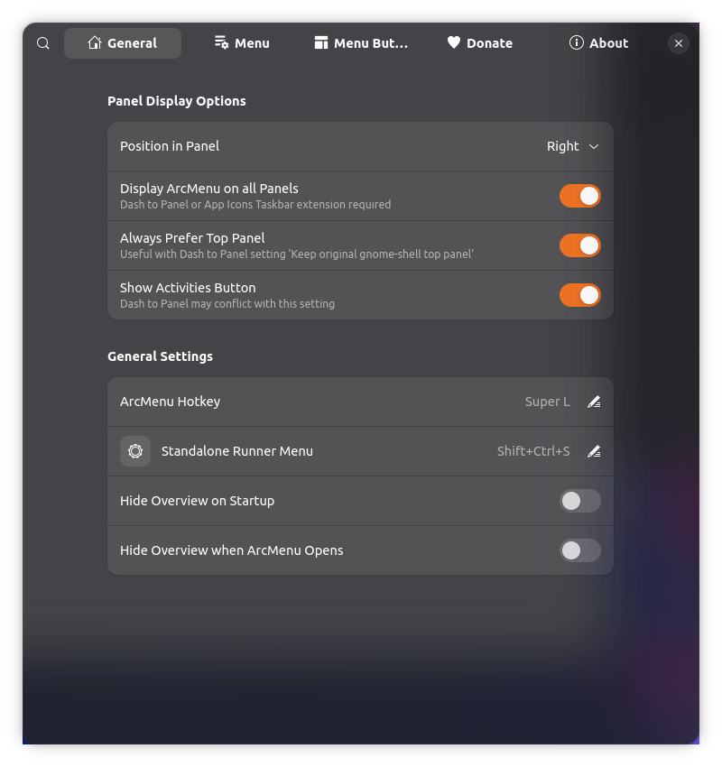

**Standalone Runner & Hotkeys**

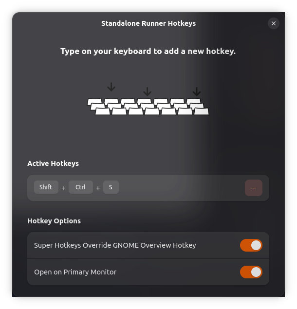

**Menu Layout**

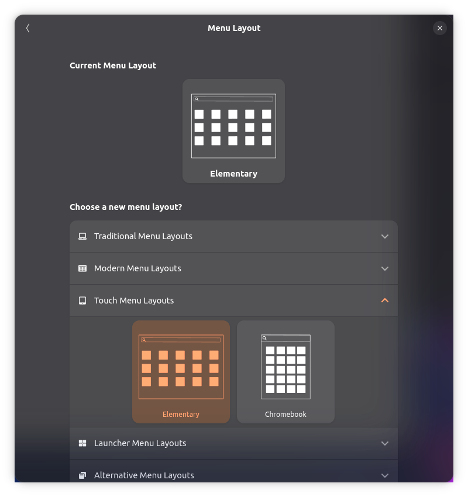

**Menu Theme**

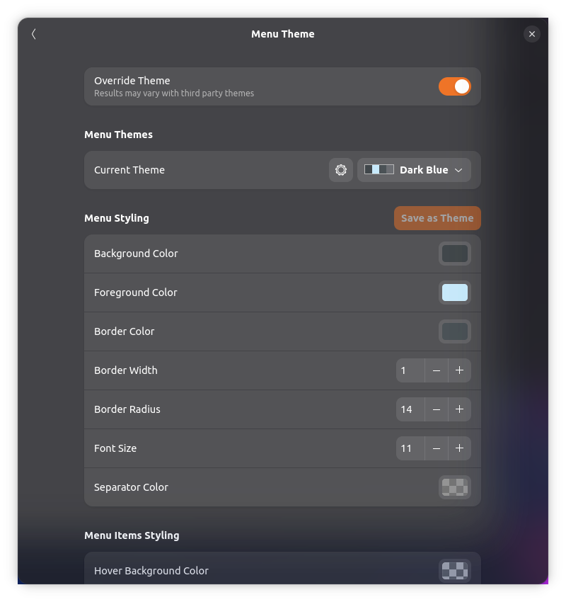

**Visual Appearance**

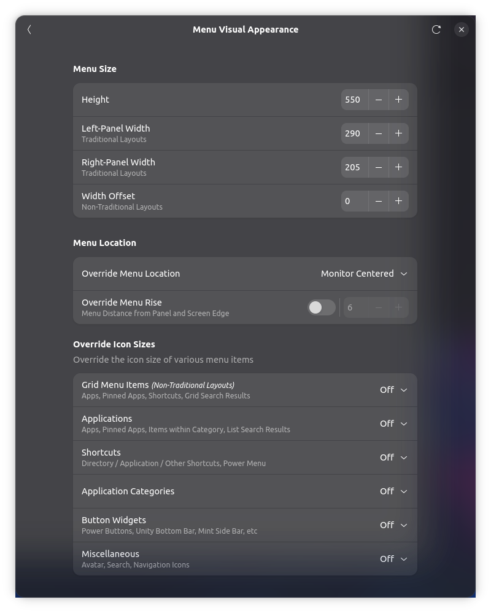

**Fine Tune**

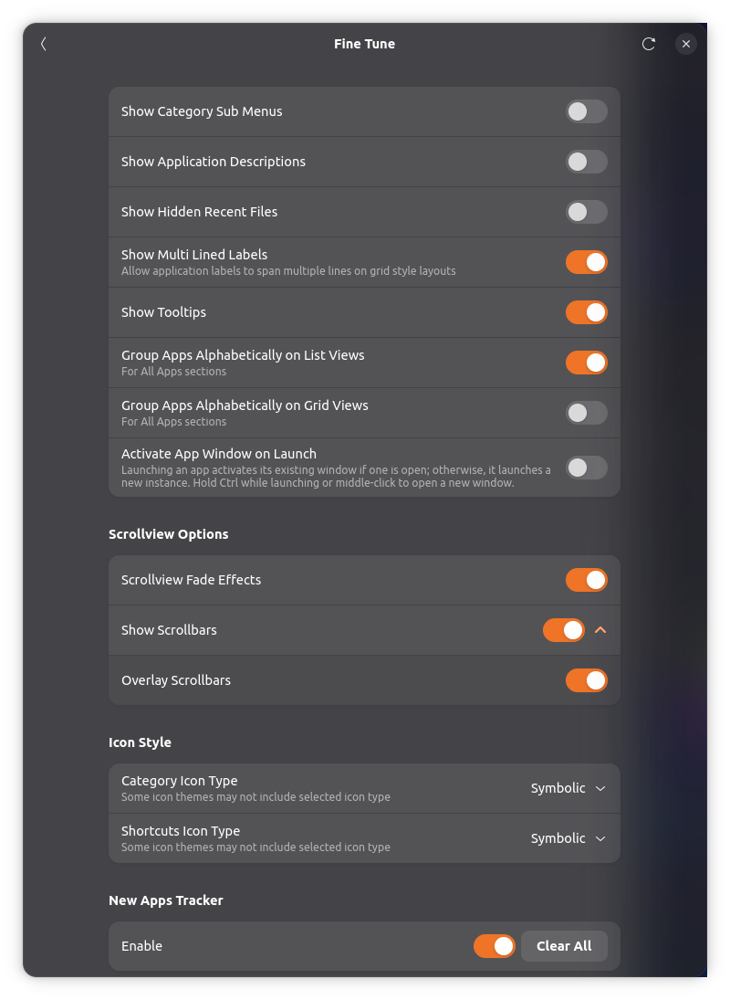

**Search Options**

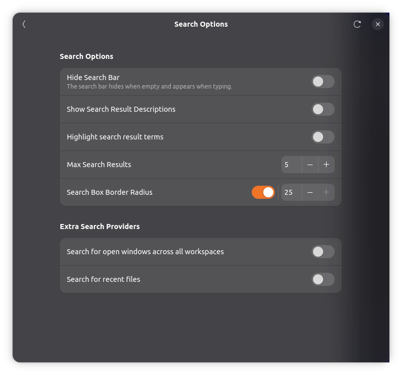

**Menu Buttons**

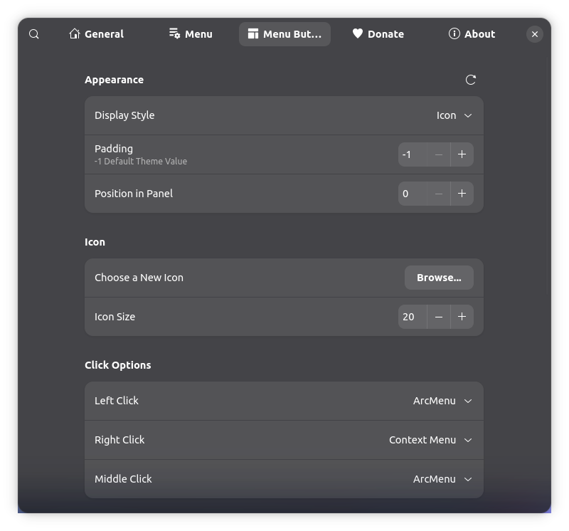

</details>

<details>
<summary><b>Dash to Dock</b></summary>

**Position & Size**


**Launcher**


**Behaviour**


**Appearance**


</details>

<details>
<summary><b>Just Perfection</b></summary>

**Behaviour**


**Customisation**


</details>

<details>
<summary><b>Forge Tiling</b></summary>

**Tiling**

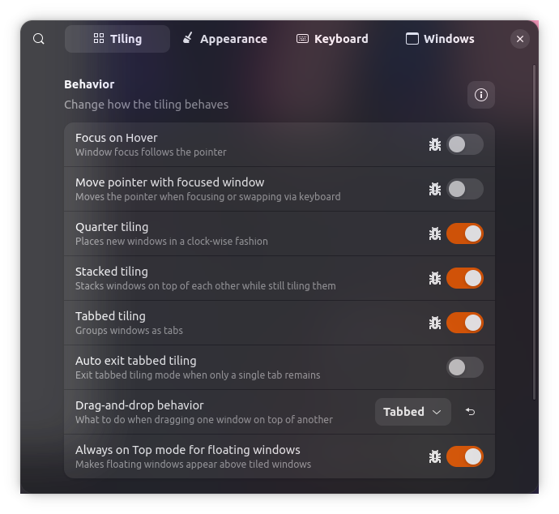

**Appearance**

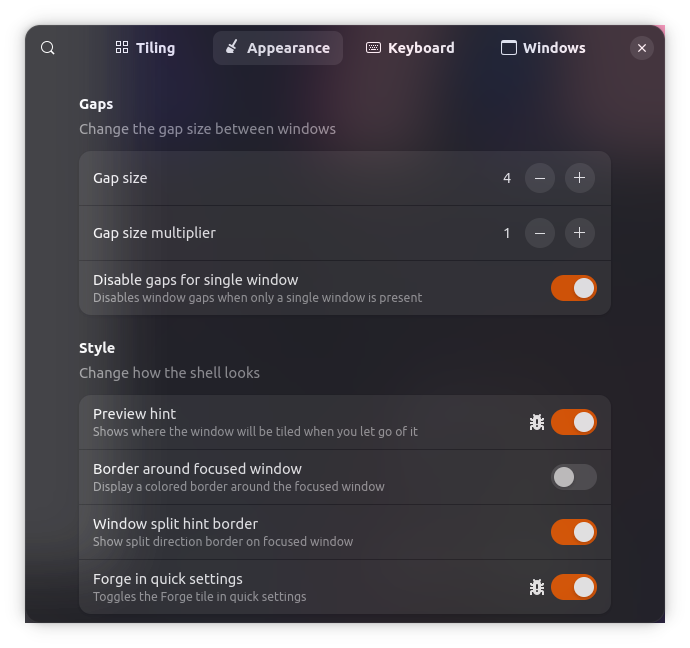

</details>

<details>
<summary><b>Tiling Shell</b></summary>

**Appearance**


**Behaviour**


**Screen Edges**


</details>

<details>
<summary><b>GSConnect (KDE Connect)</b></summary>

**Sharing**

/1-sharing.png)

**Battery**

/2-battery.png)

**Advanced / Experimental**

/3-advanced-experimental.png)

</details>

<details>
<summary><b>Quick Settings Audio Panel</b></summary>

**Extension Settings**


**Element Order**


</details>

<details>
<summary><b>Win11 Clipboard History</b></summary>

**Keyboard Shortcuts**

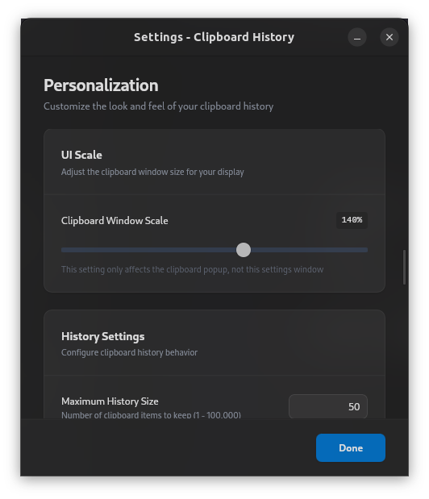

**Personalisation**

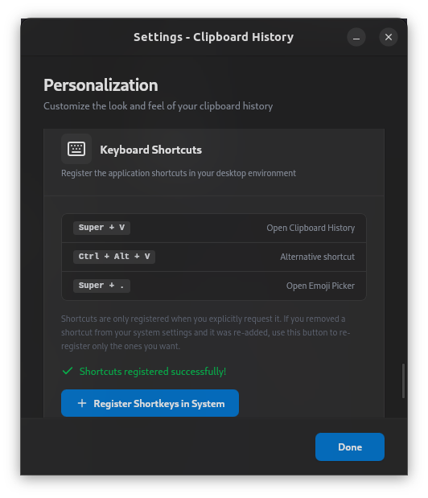

</details>

<details>
<summary><b>Copyous</b></summary>

**General**

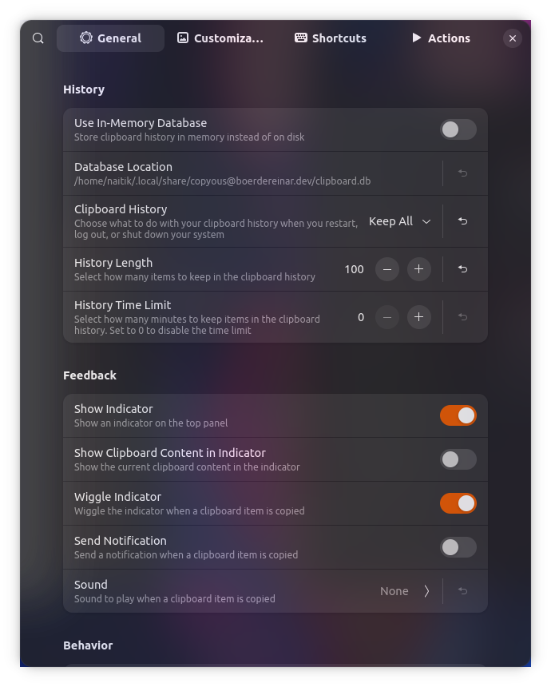

**Customisation**

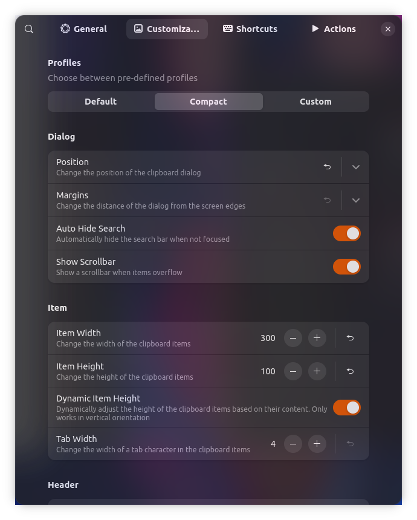

</details>

<details>
<summary><b>GTK4 Desktop Icons NG (DING)</b></summary>

**Desktop**

/1-desktop.png)

**Tweaks**

/2-tweaks.png)

**Files**

/3-files.png)

</details>

<details>
<summary><b>User Themes</b></summary>


</details>

<details>
<summary><b>Hide Top Bar</b></summary>


</details>

<details>
<summary><b>Top Bar Organiser</b></summary>


</details>

<details>
<summary><b>AppIndicator & KStatusNotifierItem Support</b></summary>


</details>

<details>
<summary><b>Caffeine</b></summary>

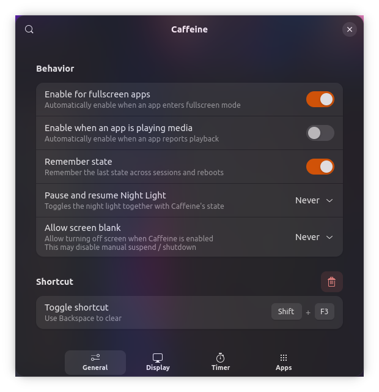

</details>

<details>
<summary><b>Compiz Magic Lamp Effect</b></summary>


</details>

<details>
<summary><b>Extension List</b></summary>


</details>

---

## Setup Guide

Here is a step by step guide to replicate this setup from a fresh Fedora install.

**1. Install GNOME Tweaks and Extension Manager**

```bash
sudo dnf install gnome-tweaks
flatpak install flathub com.mattjakeman.ExtensionManager
```

**2. Refer Appearance**

Refer to the [Appearance](#appearance) section for installing themes and fonts.

**3. Install Extensions**

Open Extension Manager or visit [extensions.gnome.org](https://extensions.gnome.org). Install everything listed in the [Extensions](#extensions) section, and configure each one using the screenshots in [Extension Configurations](#extension-configurations).

**4. Configure Apps**

Follow the per app instructions in the [Applications](#applications) section below.

> [!NOTE]
> The `configs/` folder is your reference for every setting. If something looks off, the answer is almost always in the extension config screenshots.

---

## Applications

### Firefox (Add Water)

Add Water makes Firefox look native on GNOME. It adds a cleaner titlebar, proper integration, and removes visual inconsistencies.

🔗 [flathub.org/apps/dev.qwery.AddWater](https://flathub.org/apps/dev.qwery.AddWater)

Install from Flathub, then configure as shown:

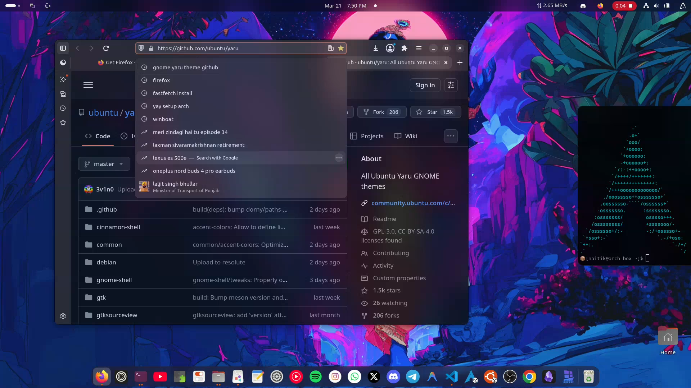

---

### Zen Browser

A cleaner, more focused browser. The transparent tabs with blur look really good with this setup.

🔗 [zen-browser.app](https://zen-browser.app)

To enable transparent tabs:

1. Open `about:config`
2. Search for `browser.tabs.allow_transparent_browser`
3. Set it to `true`

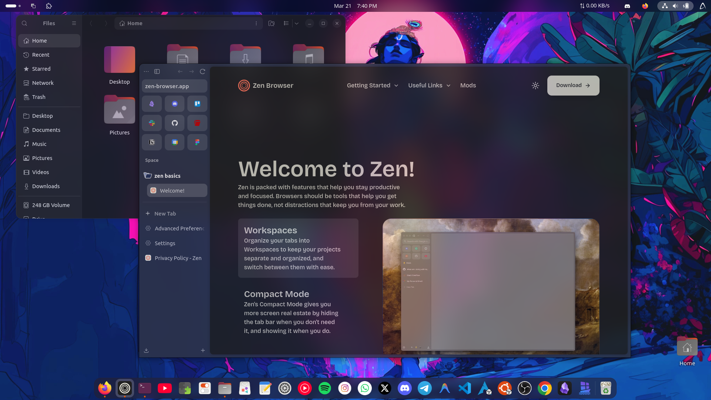

> Blur My Shell handles the blur behind the browser. Make sure the Applications pipeline is enabled in its settings.

---

### Clipboard Manager

Two clipboard options are available here. Pick whichever fits your workflow better.

**Win11 Clipboard History** mimics the Windows 11 `Win + V` clipboard panel experience.
You can install it from the GitHub link below — installation instructions are already there.

🔗 [github.com/gustavosett/Windows-11-Clipboard-History-For-Linux](https://github.com/gustavosett/Windows-11-Clipboard-History-For-Linux)

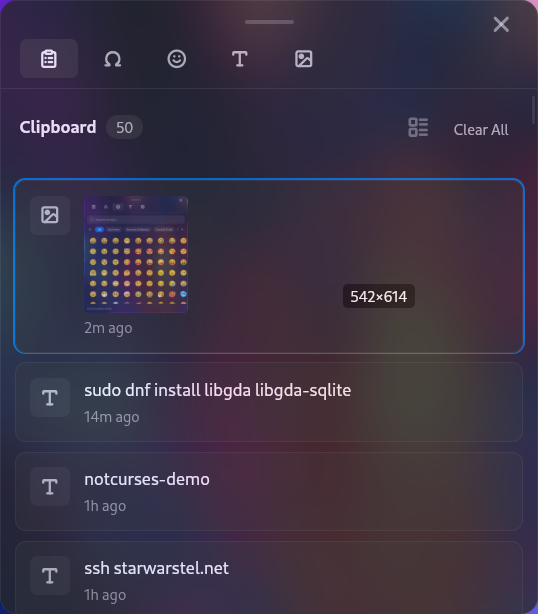

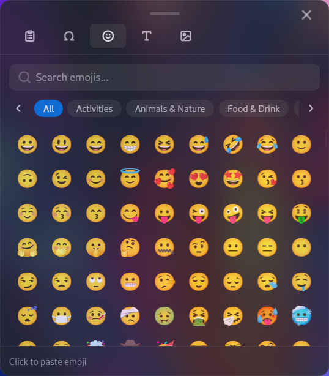

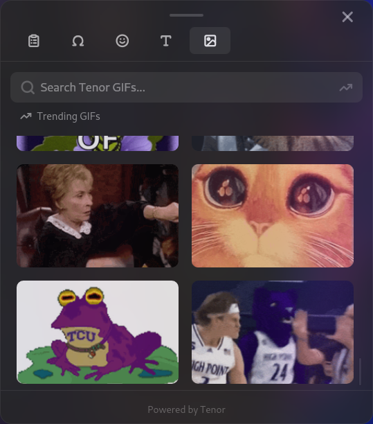

---

**Copyous** is a GNOME native clipboard manager with a clean history view.
Simpler and more lightweight. Install directly from GNOME Extensions.

🔗 [extensions.gnome.org/extension/8834/copyous](https://extensions.gnome.org/extension/8834/copyous/)

---

### Terminal

No fancy terminal emulator is needed. You can just use the built in gnome terminal with the **Linux** profile for a minimal and clean look.

1. Open Terminal
2. Go to **Preferences** (`Ctrl + ,`)
3. Select the `Linux` theme

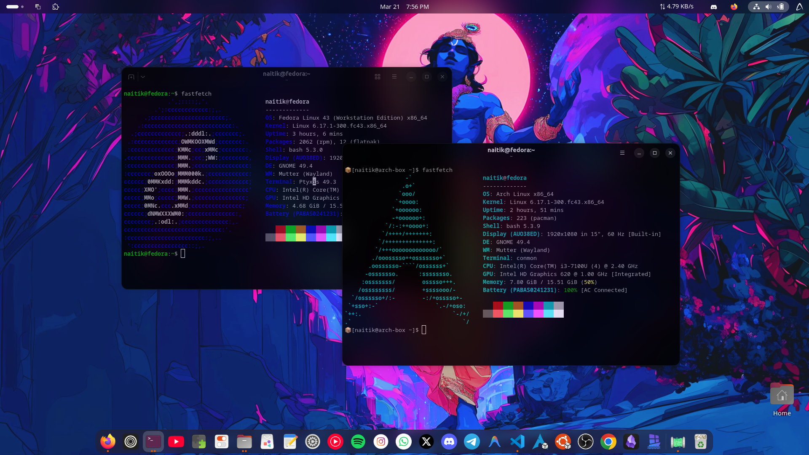

---

### VS Code & Dev Environment

Install from the official website or your package manager.

**VS Code:**

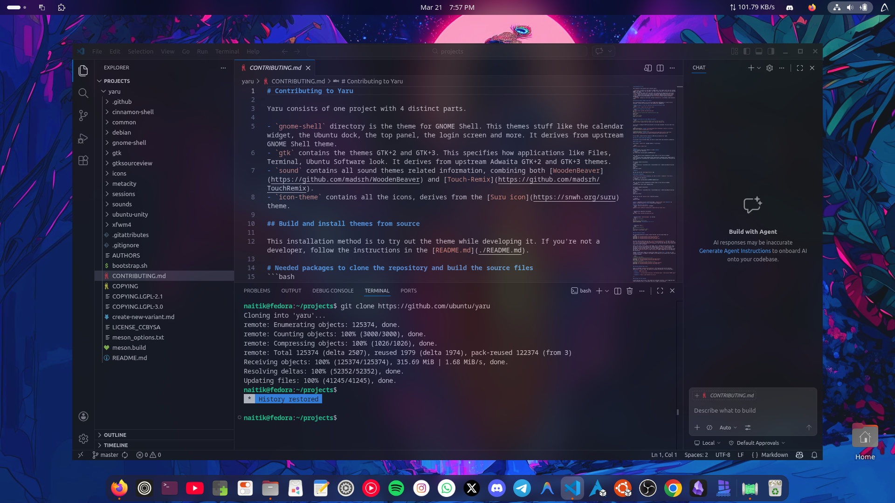

**Developer environment overview:**

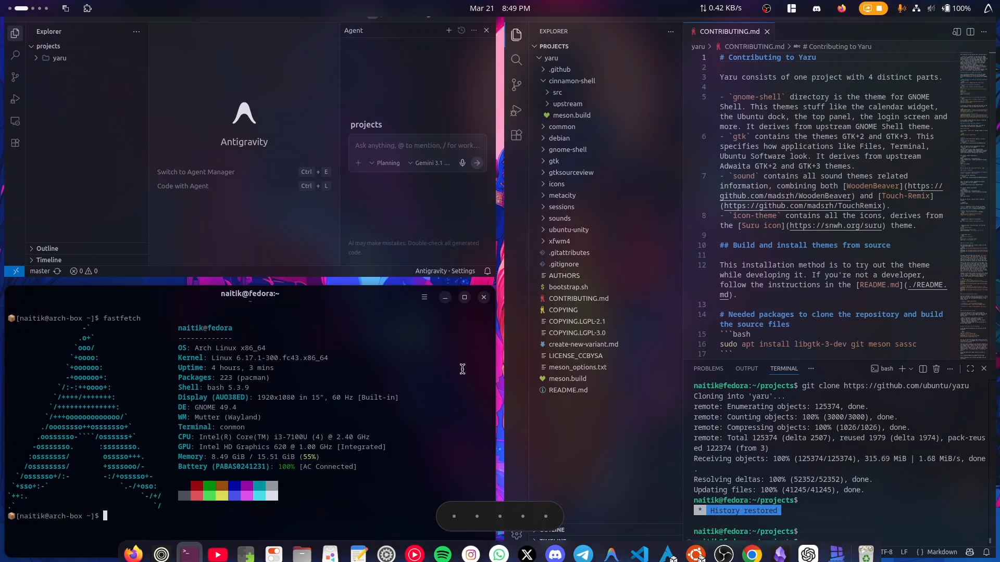

---

## Extras

These are small additions that are not strictly part of the customization process, but they make the overall experience noticeably better.

---

### Distrobox

If you ever need an Arch or Ubuntu environment for testing, `.deb` packages, or tooling that isn't on Fedora, Distrobox is the cleanest solution. It runs containers on the shared kernel, providing no performance overhead without dual-booting.

🔗 [github.com/89luca89/distrobox](https://github.com/89luca89/distrobox)

```bash
curl -s https://raw.githubusercontent.com/89luca89/distrobox/main/install | sh
```

Once set up, spin up an Ubuntu container and install `.deb` packages directly on Fedora.

---

### Winboat

For the occasional Windows application that has no Linux alternative, Winboat handles it without a full dual-boot setup.

🔗 [github.com/TibixDev/winboat](https://github.com/TibixDev/winboat)

Follow the setup instructions in the repository.

---

### Alt + Drag Windows

By default, you can only drag a window by grabbing its titlebar.
These commands let you hold `Alt` and click anywhere on a window to drag or resize it.
```bash
gsettings set org.gnome.desktop.wm.preferences mouse-button-modifier '<Alt>'
gsettings set org.gnome.desktop.wm.preferences resize-with-right-button true
```

To switch windows across all workspaces instead of just the current one:
```bash
gsettings set org.gnome.shell.window-switcher current-workspace-only false
```

---

## Directory Structure
```text
.
├── Assets/                    # Preview screenshots
├── configs/
│   ├── gnome-tweaks/          # GNOME Tweaks config screenshots
│   └── gnome-extensions/      # Per-extension config screenshots
└── README.md
```

| System Path                      | Purpose                  |
|----------------------------------|--------------------------|
| `~/.local/share/icons/`          | Cursor and icon themes   |
| `~/.themes/`                     | GTK themes               |
| `~/.local/share/sounds/`         | Sound themes             |
| `~/.local/share/fonts/`          | Custom fonts             |

---

## Troubleshooting

> [!NOTE]
> These are the most common issues people run into. Check here before opening an issue.

---

**Extensions not showing after install**

> [!TIP]
> Restart GNOME Shell without logging out:
> ```bash
> Alt + F2 → type 'r' → press Enter
> ```
> On Wayland, log out and log back in instead.

---

**Theme not applying in GNOME Tweaks**

> [!IMPORTANT]
> The **User Themes** extension must be installed and enabled.
> Shell theme will not appear without it — this is the most common mistake.

---

**Blur My Shell not working**

> [!TIP]
> Open Blur My Shell settings and go to the **Pipelines** tab.
> The default pipeline is often disabled — enable it manually.
> Check the [Extension Configurations](#extension-configurations) screenshots for reference.

---

**Cursor theme not showing in GNOME Tweaks**

> [!TIP]
> Make sure the `macOS` folder is placed **directly** inside:
> ```
> ~/.local/share/icons/
> ```
> Not inside a subfolder — the path must be exact.

---

**Yaru theme not showing after installation**

> [!TIP]
> Run this to refresh the icon cache:
> ```bash
> gtk-update-icon-cache ~/.local/share/icons/
> ```

---

**Sound theme not working**

> [!NOTE]
> GNOME sound theme support is inconsistent on Fedora.
> Some sounds may not apply — this is a known GNOME limitation, not a setup issue.

---

## Credits

All credit goes to the original authors of the tools used in this setup.

| Tool | Author |
|------|--------|
| [Yaru Theme](https://github.com/ubuntu/yaru) | The Ubuntu Team |
| [Distrobox](https://github.com/89luca89/distrobox) | 89luca89 |
| [Winboat](https://github.com/TibixDev/winboat) | TibixDev |
| [Win11 Clipboard History](https://github.com/gustavosett/Windows-11-Clipboard-History-For-Linux) | gustavosett |
| [Add Water](https://flathub.org/apps/dev.qwery.AddWater) | Flathub |
| [Zen Browser](https://zen-browser.app) | Zen Browser Team |
| [GNOME Extensions](https://extensions.gnome.org) | GNOME Project |
| [Felipe Juan's dotfiles](https://github.com/felipe-juan/dotfiles) | README structure inspiration |
| [GNOME Tweaks](https://gitlab.gnome.org/GNOME/gnome-tweaks) | GNOME Project |
| [Extension Manager](https://flathub.org/apps/com.mattjakeman.ExtensionManager) | Matt Jakeman |


---


<div align="center">


**Fedorix** is a collaborative effort by **Naitik** and **Khushi**.<br>
*Built through a lot of trial, tweaks, and constant iteration.*

*Star the Repo, Thanks!*

</div>
